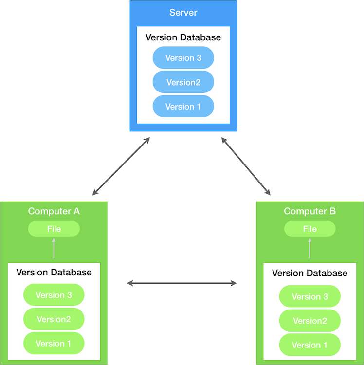

Written by: **[@suho][Su Ho]**

# Chapter 1: Git - Version Control

Everything you need to know about **git**.

> Thanks to **Scott Chacon** and **Ben Straub**, authors of the book **[Pro Git][Pro Git]**

In this chapter, I will show basic knowledges from [Pro Git][Pro Git] book, if you want more detail, you should download the book and read it.

**Table of Contents**
- [Chapter 1: Git - Version Control](#chapter-1-git---version-control)
  - [Getting Started](#getting-started)
    - [Version Control](#version-control)
    - [What is Git?](#what-is-git)
  - [Git Basics](#git-basics)
    - [Getting a Git Repository](#getting-a-git-repository)
    - [Recording Changes to the Repository](#recording-changes-to-the-repository)
  - [Git Branching](#git-branching)
  - [Git On The Server](#git-on-the-server)
  - [Distributed Git](#distributed-git)
  - [Github](#github)
  - [Git Tools](#git-tools)
  - [Custimizing Git](#custimizing-git)
  - [Git And Other Systems](#git-and-other-systems)
  - [Git Internals](#git-internals)

## Getting Started

This section will be about getting started with **Git**, then move on how to get **Git** running on system and set up to start working with.

### Version Control

Version control is a system that records changes to a file or set of files over time so that you can recall specific versions later.

If you are a developer and you want to keep every version of your code, a Version Control System (VCS) is a very wise thing to use. It allows you to revert selected files back to a previous state, revert the entire project back to a previouse state, compare changes over time, see who last modified something that might be causing a problem (then you can burn them 🤣🤣🤣), and more.

Git is a **Distributed Version Control System** (DVCS), in a DVCS, clients don't just check out the latest snapshot of the files; rather, the fully mirror the repository, including its full history. Thus, if any server dies, and these systems were collaborating via the server, any of the client repositories can be copied back up to the server to restore it.

<p align="center">
  
</p>

### What is Git?

So, what is Git in a nutshell?

#### Snapshots, Not Differences

With Git, every time you commit, or save the state of your project, Git basically takes a picture of what all your files look like at that moment and stores a reference to that snapshot. To be efficient, if files have not changed, Git doesn't store the file again, just a link to the previous identical file it has already stored.

<p align="center">
  
</p>

#### Nearly Every Operation Is Local

Most operations in Git need only local fils and resources to operate - generally no information is needed from another computer on your network. You have the entire history of the project right there on your local disk, most operations seem almost instantaneous.

For example, to browse the history of the proejct, Git doesn't need to go out to the sever to get the history and display it for you - it simply reads it directly from your local database.

#### Git Has Integrity

Everything in Git is checksummed before it is stored and is then referred to by that checksums. This means it's impossible to change to contents of any file or directory without Git knowing about it.

#### Git Generally Only Adds Data

When you do actions in Git, nearly all of them only add data to the Git database. It is hard to get the system to do anything that is not undoable or to make it erase data in any way. After you commit a a snapshot into Git, it is very difficult to lose, especially if you regularly push your database to another repository.

This makes using Git a joy because we know we can experiment without the danger of severely screwing things up.

#### The Three States

**Pay attention now** - here is the main thing to remember about Git if you want the rest of your learning process to go smoothly. Git has three main states that your files can reside in: **committed**, **modified**, and **staged**:

- Committed means that the data is safely stored in your local database
- Modifed means that you have changed the file but have not committed it to your database yet.
- Staged means that you have marked a modified file in its current version to go into your next commit snapshot

<p align="center">
  
</p>

- **The Git directory** is where Git stores the metadata and object database for your project. This is the most important part of Git, and it is what is copied when you clone a repository from another computer
- **The working tree** (working directory) is a single checkout of one version of the project. These files are pulled out of the compressed database in the Git directory and placed on disk for you to use or modify.
- **The staging area** is a file, generally contained in your Git directory, that stores information about what will go into your next commit.

The basic Git workflow goes something like this:

1. You modify files in your working tree
2. You selectively stage just those changes you want to be part of your next commit, which adds only those changes to the staging area.
3. You do a commit, which takes the files as they are in the staging area and stores that snapshot permanently to your Git directory.

#### The Command Line

There are a lot of different ways to use Git. There are the original command-line tools, and there are many graphical user interfaces of varying capabilities. For backend developer, I suggest using Git on the command line. For one, the command line is the only place you can run all Git commands.

#### Installing Git

You need to go to the website [git-scm.com][git-scm] for download and install **Git**.

After download and install, run **git** from terminal the very first time

```sh
git --version
```

#### First-Time Git Setup

Now that you have Git on your system, you will want to do a few things to customize your Git environment.

First, you can view all of your settings and where they are coming from using:

```sh
git config --list --show-origin
```

#### Your Identity

The first thing you should do when you install Git is set your username and email address. This is important because every Git commit uses this information, and it's immutably baked into the commits you start creating

```bash
git config --global user.name suho
git config --global user.email suho@example.com
```

Because Git will always use that information for anything you do on that system so you need to to do this only once if you pass the `--global` option. Without `--global`, you will use different name or email for specific projects.

#### Checking Your Settings

If you want to check your configuration, run:

```sh
git config --list
```

## Git Basics

In this section, we will learn how to use Git in the 80% of cases you'll encounter most often. After this section, you will be able to clone a repository, see what has happened in the history of the project, modify files, and contribute changes.

### Getting a Git Repository

You typically obtain a Git repository in one of two ways:

1. You can take a local directory that is currently not under version control, and turn it into a Git
repository, or
2. You can clone an existing Git repository from elsewhere.

#### Initializing a Repository in an Existing Directory

You first need to go to that project’s directory.

```bash
cd ~/your-project
```

and type:

```bash
git init
```

This creates a new subdirectory named .git that contains all of your necessary repository files — a
Git repository skeleton

#### Cloning an Existing Repository

If you want to get a copy of an existing Git repository — for example, a project you’d like to
contribute to — the command you need is `git clone`.

Every version of every file for the history of the project is pulled down by default
when you run `git clone`.

You clone a repository with git clone <url>. For example, if you want to clone the Git linkable
library called `libgit2`, you can do so like this:

```bash
git clone https://github.com/libgit2/libgit2
```

That creates a directory named `libgit2`, initializes a .git directory inside it, pulls down all the data
for that repository, and checks out a working copy of the latest version. If you go into the new
`libgit2` directory that was just created, you’ll see the project files in there, ready to be worked on or
used.

If you want to clone the repository into a directory named something other than `libgit2`, you can
specify the new directory name as an additional argument:

```bash
git clone https://github.com/libgit2/libgit2 mylibgit
```

### Recording Changes to the Repository

Each file in your working directory can be in one of two states: tracked or
untracked. 

**Tracked files** are files that were in the last snapshot; they can be unmodified, modified,
or staged. In short, tracked files are files that Git knows about.

**Untracked files** are everything else — any files in your working directory that were not in your last
snapshot and are not in your staging area. When you first clone a repository, all of your files will be
tracked and unmodified because Git just checked them out and you haven’t edited anything.

<p align="center">
  
</p>

## Git Branching

In this section, you will learn what truly sets Git apart from the pack

## Git On The Server

This section is for those of you who want to set up Git inside your organization or on your own personal server for collaboration.

## Distributed Git

We will go over in full detail various distributed workflows and how to accomplish them with Git, after this section, you will be able to work expertly with multiple remote repositories

## Github

We will cover signing up for and managing an account, creating and using Git repositories, common workflows to contribute to projects and more features of Github.

## Git Tools

Here you will learn about topics like mastering the scary **reset** command, using binary search to identify bugs, editing history, revision selection in detail, and a lot more.

## Custimizing Git

This section includes setting up hook scripts to enforce or encourage customized policies and using environment configuration settings so you can work the way you want.

## Git And Other Systems

This includes using Git in a Subversion (SVN) world and converting projects from ohter VCSs to Git

## Git Internals

After know all about Git and can wield it with power and grace, you can move on to discuss how Git stores its objects, what is object model is, details of packfiles, server protocols, and more

[Su Ho]: https://github.com/suho
[Pro Git]: https://git-scm.com/book/en/v2
[Image 1]: ../img/section1.chapter1/Image1.jpg
[Image 2]: ../img/section1.chapter1/Image2.jpg
[Image 3]: ../img/section1.chapter1/Image3.jpg
[Image 4]: ../img/section1.chapter1/Image4.png
[git-scm]: https://git-scm.com