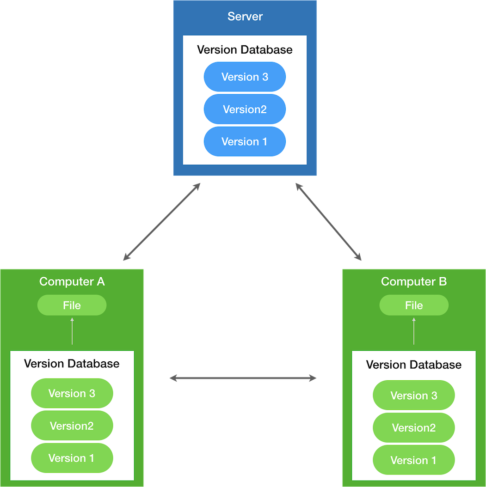
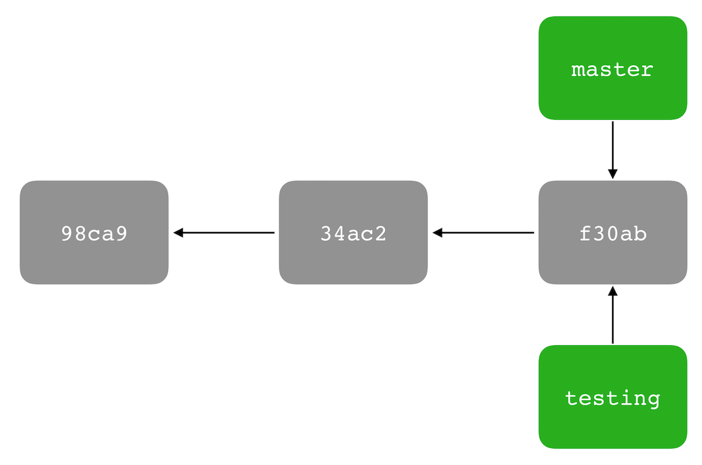
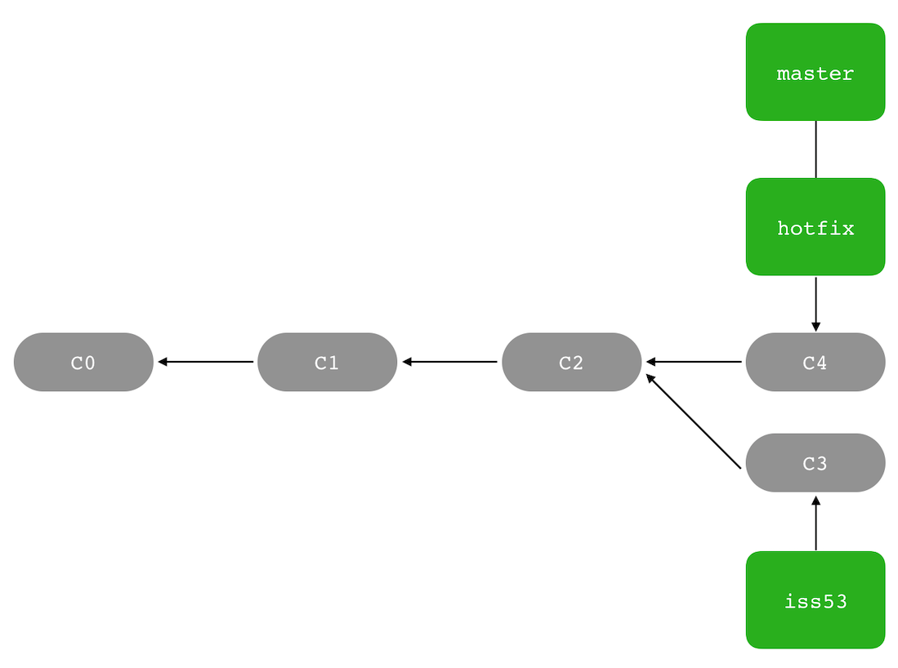

Written by: **[@suho][Su Ho]**

# Chapter 1: Git - Version Control

Everything you need to know about **git**.

> Thanks to **Scott Chacon** and **Ben Straub**, authors of the book **[Pro Git][Pro Git]**

In this chapter, I will show basic knowledges from [Pro Git][Pro Git] book, if you want more detail, you should download the book and read it.

**Table of Contents**
- [Chapter 1: Git - Version Control](#chapter-1-git---version-control)
  - [Getting Started](#getting-started)
    - [Version Control](#version-control)
    - [What is Git?](#what-is-git)
  - [Git Basics](#git-basics)
    - [Getting a Git Repository](#getting-a-git-repository)
    - [Recording Changes to the Repository](#recording-changes-to-the-repository)
    - [Viewing the Commit History](#viewing-the-commit-history)
    - [Undoing Things](#undoing-things)
    - [Working with Remotes](#working-with-remotes)
    - [Tagging](#tagging)
  - [Git Branching](#git-branching)
    - [Branches in a Nutshell](#branches-in-a-nutshell)
    - [Basic Branching and Merging](#basic-branching-and-merging)
    - [Branch Management](#branch-management)
    - [Rebasing](#rebasing)

## Getting Started

This section will be about getting started with **Git**, then move on how to get **Git** running on system and set up to start working with.

### Version Control

Version control is a system that records changes to a file or set of files over time so that you can recall specific versions later.

If you are a developer and you want to keep every version of your code, a Version Control System (VCS) is a very wise thing to use. It allows you to revert selected files back to a previous state, revert the entire project back to a previouse state, compare changes over time, see who last modified something that might be causing a problem (then you can burn them 🤣🤣🤣), and more.

Git is a **Distributed Version Control System** (DVCS), in a DVCS, clients don't just check out the latest snapshot of the files; rather, the fully mirror the repository, including its full history. Thus, if any server dies, and these systems were collaborating via the server, any of the client repositories can be copied back up to the server to restore it.

<p align="center">
  
</p>

### What is Git?

So, what is Git in a nutshell?

#### Snapshots, Not Differences

With Git, every time you commit, or save the state of your project, Git basically takes a picture of what all your files look like at that moment and stores a reference to that snapshot. To be efficient, if files have not changed, Git doesn't store the file again, just a link to the previous identical file it has already stored.

<p align="center">
  
</p>

#### Nearly Every Operation Is Local

Most operations in Git need only local fils and resources to operate - generally no information is needed from another computer on your network. You have the entire history of the project right there on your local disk, most operations seem almost instantaneous.

For example, to browse the history of the proejct, Git doesn't need to go out to the sever to get the history and display it for you - it simply reads it directly from your local database.

#### Git Has Integrity

Everything in Git is checksummed before it is stored and is then referred to by that checksums. This means it's impossible to change to contents of any file or directory without Git knowing about it.

#### Git Generally Only Adds Data

When you do actions in Git, nearly all of them only add data to the Git database. It is hard to get the system to do anything that is not undoable or to make it erase data in any way. After you commit a a snapshot into Git, it is very difficult to lose, especially if you regularly push your database to another repository.

This makes using Git a joy because we know we can experiment without the danger of severely screwing things up.

#### The Three States

**Pay attention now** - here is the main thing to remember about Git if you want the rest of your learning process to go smoothly. Git has three main states that your files can reside in: **committed**, **modified**, and **staged**:

- Committed means that the data is safely stored in your local database
- Modifed means that you have changed the file but have not committed it to your database yet.
- Staged means that you have marked a modified file in its current version to go into your next commit snapshot

<p align="center">
  
</p>

- **The Git directory** is where Git stores the metadata and object database for your project. This is the most important part of Git, and it is what is copied when you clone a repository from another computer
- **The working tree** (working directory) is a single checkout of one version of the project. These files are pulled out of the compressed database in the Git directory and placed on disk for you to use or modify.
- **The staging area** is a file, generally contained in your Git directory, that stores information about what will go into your next commit.

The basic Git workflow goes something like this:

1. You modify files in your working tree
2. You selectively stage just those changes you want to be part of your next commit, which adds only those changes to the staging area.
3. You do a commit, which takes the files as they are in the staging area and stores that snapshot permanently to your Git directory.

#### The Command Line

There are a lot of different ways to use Git. There are the original command-line tools, and there are many graphical user interfaces of varying capabilities. For backend developer, I suggest using Git on the command line. For one, the command line is the only place you can run all Git commands.

#### Installing Git

You need to go to the website [git-scm.com][git-scm] for download and install **Git**.

After download and install, run **git** from terminal the very first time

```sh
git --version
```

#### First-Time Git Setup

Now that you have Git on your system, you will want to do a few things to customize your Git environment.

First, you can view all of your settings and where they are coming from using:

```sh
git config --list --show-origin
```

#### Your Identity

The first thing you should do when you install Git is set your username and email address. This is important because every Git commit uses this information, and it's immutably baked into the commits you start creating

```bash
$ git config --global user.name suho
$ git config --global user.email suho@example.com
```

Because Git will always use that information for anything you do on that system so you need to to do this only once if you pass the `--global` option. Without `--global`, you will use different name or email for specific projects.

#### Checking Your Settings

If you want to check your configuration, run:

```sh
git config --list
```

## Git Basics

In this section, we will learn how to use Git in the 80% of cases you'll encounter most often. After this section, you will be able to clone a repository, see what has happened in the history of the project, modify files, and contribute changes.

### Getting a Git Repository

You typically obtain a Git repository in one of two ways:

1. You can take a local directory that is currently not under version control, and turn it into a Git repository, or
2. You can clone an existing Git repository from elsewhere.

#### Initializing a Repository in an Existing Directory

You first need to go to that project’s directory.

```bash
$ cd ~/your-project
```

and type:

```bash
$ git init
```

This creates a new subdirectory named .git that contains all of your necessary repository files — a Git repository skeleton

#### Cloning an Existing Repository

If you want to get a copy of an existing Git repository — for example, a project you’d like to contribute to — the command you need is `git clone`.

Every version of every file for the history of the project is pulled down by default when you run `git clone`.

### Recording Changes to the Repository

Each file in your working directory can be in one of two states: tracked or untracked. 

**Tracked files** are files that were in the last snapshot; they can be unmodified, modified, or staged. In short, tracked files are files that Git knows about.

**Untracked files** are everything else — any files in your working directory that were not in your last snapshot and are not in your staging area. When you first clone a repository, all of your files will be tracked and unmodified because Git just checked them out and you haven’t edited anything.

<p align="center">
  
</p>

#### Checking the Status of Your Files

The main tool you use to determine which files are in which state is the `git status` command.

```bash
$ git status
```

#### Tracking New Files

In order to begin tracking a new file, you use the command `git add`. To begin tracking the README file, you can run this:

```bash
$ git add [fileName]
```

#### Staging Modified Files

`git add` is a **multipurpose** command — you use it to begin **tracking new files**, to **stage files**, and to do other things like **marking merge-conflicted files as resolved**.

#### Short Status

While the git status output is pretty comprehensive, it’s also quite wordy. Git also has a short status flag so you can see your changes in a more compact way

```bash
$ git status -s
```

#### Ignoring Files

Often, you’ll have a class of files that you don’t want Git to automatically add or even show you as being untracked. These are generally automatically generated files such as log files or files produced by your build system. In such cases, you can create a file listing patterns to match them named `.gitignore`. 

Here is an example `.gitignore` file:

```bash
# ignore all .a files
*.a
# but do track lib.a, even though you're ignoring .a files above
!lib.a
# only ignore the TODO file in the current directory, not subdir/TODO
/TODO
# ignore all files in any directory named build
build/
# ignore doc/notes.txt, but not doc/server/arch.txt
doc/*.txt
# ignore all .pdf files in the doc/ directory and any of its subdirectories
doc/**/*.pdf
```

The rules for the patterns you can put in the `.gitignore` file are as follows:
- Blank lines or lines starting with # are ignored.
- Standard glob patterns work, and will be applied recursively throughout the entire working tree.
- You can start patterns with a forward slash (/) to avoid recursivity.
- You can end patterns with a forward slash (/) to specify a directory.
- You can negate a pattern by starting it with an exclamation point (!).

#### Viewing Your Staged and Unstaged Changes

If you want to know exactly what you changed, not just which files were changed — you can use the `git diff` command

```bash
$ git diff
```

#### Committing Your Changes

Now that your staging area is set up the way you want it, you can commit your changes. Remember that anything that is still unstaged — any files you have created or modified that you haven’t run git add on since you edited them — won’t go into this commit. They will stay as modified files on your disk. In this case, let’s say that the last time you ran git status, you saw that everything was staged, so you’re ready to commit your changes. 

The simplest way to commit is to type git commit:

```bash
$ git commit
```

Alternatively, you can type your commit message inline with the commit command by specifying it
after a -m flag, like this:

```bash
$ git commit -m "Story 01: Fix Login UI`
```

### Viewing the Commit History

After you have created several commits, or if you have cloned a repository with an existing commit history, you’ll probably want to look back to see what has happened. The most basic and powerful tool to do this is the git log command.

```bash
$ git log
```

#### Common Options to `git log`

| Option          | Description                                                                                                                        |
| --------------- | ---------------------------------------------------------------------------------------------------------------------------------- |
| -p              | Show the patch introduced with each commit.                                                                                        |
| --stat          | Show statistics for files modified in each commit.                                                                                 |
| --shortstat     | Display only the changed/insertions/deletions line from the --stat command.                                                        |
| --name-only     | Show the list of files modified after the commit information.                                                                      |
| --name-status   | Show the list of files affected with added/modified/deleted information as well.                                                   |
| --abbrev-commit | Show only the first few characters of the SHA-1 checksum instead of all 40.                                                        |
| --relative-date | Display the date in a relative format (for example, “2 weeks ago”) instead of using the full date format.                          |
| --graph         | Display an ASCII graph of the branch and merge history beside the log output.                                                      |
| --pretty        | Show commits in an alternate format. Options include oneline, short, full, fuller, and format (where you specify your own format). |
| --oneline       | Shorthand for --pretty=oneline --abbrev-commit used together                                                                       |

### Undoing Things

One of the common undos takes place when you commit too early and possibly forget to add some files, or you mess up your commit message. If you want to redo that commit, make the additional changes you forgot, stage them, and commit again using the --amend option:

```bash
$ git commit --amend
```

#### Unstaging a Staged File

Use `git reset HEAD <file>...` to unstage.

> It’s true that git reset can be a dangerous command, especially if you provide the `--hard` flag. However, in the scenario described above, the file in your working directory is not touched, so it’s relatively safe.

#### Unmodifying a Modified File

What if you realize that you don’t want to keep your changes to the CONTRIBUTING.md file? How can you easily unmodify it — revert it back to what it looked like when you last committed.

Use `git checkout -- <file>...` to discard changes in working directory.

### Working with Remotes

To be able to collaborate on any Git project, you need to know how to manage your remote repositories. Remote repositories are versions of your project that are hosted on the Internet or network somewhere.

> Remote repositories can be on your local machine.

#### Showing your remotes

To see which remote servers you have configured, you can run the `git remote` command.

```bash
$ git remote
```

You can also specify -v, which shows you the URLs that Git has stored for the shortname to be used when reading and writing to that remote.

```bash
$ git remote -v
```

#### Adding Remote Repositories

Here’s how to add a new remote explicitly. To add a new remote Git repository as a shortname you can reference easily, run `git remote add <shortname> <url>`:

```bash
$ git remote add suho https://github.com/suho/backend-and-go
```

Now you can fetch all the information

```bash
$ git fetch suho
```

#### Fetching and Pulling from Your Remotes

As you just saw, to get data from your remote projects, you can run:

```bash
$ git fetch <remote>
```

If your **current branch** is set up to track a remote branch, you can use the `git pull` command to automatically fetch and then merge that remote branch into your current branch.

#### Pushing to Your Remotes

When you have your project at a point that you want to share, you have to push it upstream. 

The command for this is simple: `git push <remote> <branch>`. 

If you want to push your master branch to your origin server (again, cloning generally sets up both of those names for you automatically), then you can run this to push any commits you’ve done back up to the server:

```bash
$ git push origin master
```

#### Inspecting a Remote

If you want to see more information about a particular remote, you can use the `git remote show <remote>` command.

```bash
$ git remote show origin
```

#### Renaming and Removing Remotes

You can run `git remote rename` to change a remote’s shortname. For instance, if you want to rename
`suho` to `sh`, you can do so with git remote rename:

```bash
$ git remove remove suho sh
```

### Tagging

Git has the ability to tag specific points in a repository’s history as being important. Typically, people use this functionality to mark release points (v1.0, v2.0 and so on). In this section, you’ll learn how to list existing tags, how to create and delete tags, and what the different types of tags are.

#### Listing Your Tags

Listing the existing tags in Git is straightforward. Just type `git tag` (with optional -l or --list):

```bash
$ git tag
```

#### Creating Tags

Git supports two types of tags: **lightweight** and **annotated**.

A **lightweight** tag is very much like a branch that doesn’t change — it’s just a pointer to a specific commit.

**Annotated** tags, however, are stored as full objects in the Git database. They’re checksummed; contain the tagger name, email, and date; have a tagging message; and can be signed and verified with GNU Privacy Guard (GPG). It’s generally recommended that you create annotated tags so you can have all this information; but if you want a temporary tag or for some reason don’t want to keep the other information, lightweight tags are available too.

**Annotated Tags**

Creating an annotated tag in Git is simple. The easiest way is to specify -a when you run the tag command:

```bash
$ git tag -a v0.0.1 -m "Version 0.0.1"
```

You can see the tag data with `git show` command

```bash
$ git show v0.0.1
```

**Lightweight Tags**

Another way to tag commits is with a lightweight tag. This is basically the commit checksum stored in a file — no other information is kept. To create a lightweight tag, don’t supply any of the `-a`, `-s`, or `-m` options, just provide a tag name:

```bash
$ git tag v0.0.2-lw
```

If you run git show on the tag (v0.0.2-lw), you don’t see the extra tag information.

#### Sharing Tags

By default, the `git push` command doesn’t transfer tags to remote servers. You will have to explicitly push tags to a shared server after you have created them.

This process is just like sharing remote branches — you can run `git push origin <tagname>`

```bash
$ git push origin v0.0.1

# Push all tags
git push origin --tags
```

#### Deleting Tags

To delete a tag on your local repository, you can use `git tag -d <tagname>`. For example, we could remove our lightweight tag above as follows:

```bash
$ git tag -d v0.0.2-lw
```

> Note that this does not remove the tag from any remote servers. 

The way to delete a remote tag is with:

```bash
$ git push origin --delete <tagname>
```

#### Checking out Tags
If you want to view the versions of files a tag is pointing to, you can do a `git checkout` of that tag

```bash
$ git checkout v0.0.1
```

## Git Branching

Branching means you diverge from the main line of development and continue to do work without messing with that main line.

Git’s branching model as its `killer feature`. The way Git branches is incredibly lightweight, making branching operations nearly instantaneous, and switching back and forth between branches generally just as fast.

### Branches in a Nutshell

The default branch name in Git is `master`. As you start making commits, you’re given a `master` branch that points to the last commit you made. Every time you commit, the `master` branch pointer moves forward automatically.

> The “master” branch in Git is not a special branch. It is exactly like any other branch. The only reason nearly every repository has one is that the `git init` command creates it by default and most people don’t bother to change it.

<p align="center">
  
</p>

#### Creating a New Branch

What happens when you create a new branch? Well, doing so creates a new pointer for you to move around. Let’s say you want to create a new branch called testing. You do this with the git branch command:

```bash
$ git branch testing
```

This creates a new pointer to the same commit you’re currently on.

<p align="center">
  
</p>

The `git branch` command only **created** a new branch — it didn’t **switch** to that branch.

<p align="center">
  
</p>

#### Switching Branches

To switch to an existing branch, you run the `git checkout` command. Let’s switch to the new `testing` branch:

```bash
$ git checkout testing
```

This moves `HEAD` to point to the `testing` branch.

<p align="center">
  
</p>

The `HEAD` branch moves forward when a commit is made

<p align="center">
  
</p>

This is interesting, because now your `testing` branch has moved forward, but your `master` branch still points to the commit you were on when you ran `git checkout` to switch branches. Let’s switch back to the `master` branch:

```bash
$ git checkout master
```

<p align="center">
  
</p>

Now, let’s make a few changes and commit again.

<p align="center">
  
</p>

### Basic Branching and Merging

Let’s go through a simple example of branching and merging with a workflow that you might use in
the real world. You’ll follow these steps:

1. Do some work on a website.
2. Create a branch for a new user story you’re working on.
3. Do some work in that branch.

At this stage, you’ll receive a call that another issue is critical and you need a hotfix. You’ll do the
following:

1. Switch to your production branch.
2. Create a branch to add the hotfix.
3. After it’s tested, merge the hotfix branch, and push to production.
4. Switch back to your original user story and continue working.

#### Basic Branching

First, let’s say you’re working on your project and have a couple of commits already on the master branch.

<p align="center">
  
</p>

You’ve decided that you’re going to work on issue #53 in whatever issue-tracking system your company uses. 

To create a new branch and switch to it at the same time, you can run the `git checkout` command with the `-b` switch:

```bash
$ git checkout -b iss53
```

This is shorthand for:

```bash
$ git branch iss53
git checkout iss53
```

You work on your website and do some commits. Doing so moves the iss53 branch forward, because you have it checked out (that is, your HEAD is pointing to it).

<p align="center">
  
</p>

Now you get the call that there is an issue with the website, and you need to fix it immediately. With Git, you don’t have to deploy your fix along with the `iss53` changes you’ve made, and you don’t have to put a lot of effort into reverting those changes before you can work on applying your fix to what is in production. All you have to do is switch back to your `master` branch.

```bash
$ git checkout master
```

Next, you have a `hotfix` to make. Let’s create a `hotfix` branch on which to work until it’s completed

```bash
$ git checkout -b hotfix
```

<p align="center">
  
</p>

You can run your tests, make sure the hotfix is what you want, and finally merge the `hotfix` branch back into your `master` branch to deploy to production. You do this with the `git merge` command

```bash
$ git checkout master
git merge hotfix
```

<p align="center">
  
</p>

After your super-important fix is deployed, you’re ready to switch back to the work you were doing before you were interrupted. However, first you’ll delete the `hotfix` branch, because you no longer need it — the `master` branch points at the same place. You can delete it with the `-d` option to `git branch`:

```bash
$ git branch -d hotfix
```

Now you can switch back to your work-in-progress branch on issue #53 and continue working on it.

```bash
$ git checkout iss53
```

![Image 16]

It’s worth noting here that the work you did in your `hotfix` branch is not contained in the files in your `iss53` branch. If you need to pull it in, you can merge your `master` branch into your `iss53` branch by running `git merge master`, or you can wait to integrate those changes until you decide to pull the `iss53` branch back into `master` later.

#### Basic Merging

Suppose you’ve decided that your issue #53 work is complete and ready to be merged into your `master` branch. In order to do that, you’ll merge your `iss53` branch into `master`, much like you merged your `hotfix` branch earlier. All you have to do is check out the branch you wish to merge into and then run the git merge command:

```bash
$ git checkout master
git merge iss53
```

![Image 17]

Now that your work is merged in, you have no further need for the `iss53` branch. You can close the ticket in your ticket-tracking system, and delete the branch:

```bash
$ git branch -d iss53
```

#### Basic Merge Conflicts

Occasionally, this process doesn’t go smoothly. If you changed the same part of the same file differently in the two branches you’re merging, Git won’t be able to merge them cleanly. If your fix for issue #53 modified the same part of a file as the hotfix branch, you’ll get a merge conflict that looks something like this

```bash
$ git merge iss53
Auto-merging index.html
CONFLICT (content): Merge conflict in index.html
Automatic merge failed; fix conflicts and then commit the result.
```

Anything that has merge conflicts and hasn’t been resolved is listed as unmerged. Git adds standard conflict-resolution markers to the files that have conflicts, so you can open them manually and resolve those conflicts. Your file contains a section that looks something like this:

```html
<<<<<<< HEAD:index.html
<div id="footer">Contact : e.support@example.com</div>
=======
<div id="footer">
Please contact us at support@example.com
</div>
>>>>>>> iss53:index.html
```

This means the version in HEAD (your master branch, because that was what you had checked out when you ran your merge command) is the top part of that block (everything above the =======), while the version in your iss53 branch looks like everything in the bottom part.

In order to resolve the conflict, you have to either choose one side or the other or merge the contents yourself. For instance, you might resolve this conflict by replacing the entire block with this: 

```html
<div id="footer">
please contact us at email.support@github.com
</div>
```

### Branch Management

Now that you’ve created, merged, and deleted some branches, let’s look at some branchmanagement tools that will come in handy when you begin using branches all the time.

The `git branch` command does more than just create and delete branches. If you run it with no arguments, you get a simple listing of your current branches:

```bash
$ git branch
  iss53
* master
  testing
```

> Notice the `*` character that prefixes the `master` branch: it indicates the branch that you currently
have checked out (i.e., the branch that `HEAD` points to)

To see the last commit on each branch, you can run `git branch -v`:

```bash
$ git branch -v
```

The useful `--merged` and `--no-merged` options can filter this list to branches that you have or have not yet merged into the branch you’re currently on

```bash
$ git branch --merged
$ git branch --no-merged
```

### Rebasing

In Git, there are two main ways to integrate changes from one branch into another: the merge and the rebase. In this section you’ll learn what rebasing is, how to do it, why it’s a pretty amazing tool, and in what cases you won’t want to use it.

#### The Basic Rebase

If you go back to an earlier example from [Basic Merging](#basic-merging), you can see that you diverged your work
and made commits on two different branches.

<p align="center">
  
</p>

The easiest way to integrate the branches, as we’ve already covered, is the `merge` command.

<p align="center">
  
</p>

However, there is another way: you can take the patch of the change that was introduced in `C4` and reapply it on top of `C3`. In Git, this is called `rebasing`. With the `rebase` command, you can take all the changes that were committed on one branch and replay them on a different branch.

For this example, you would check out the `experiment` branch, and then rebase it onto the master branch as `follows`

```bash
$ git checkout experiment
$ git rebase master
```

<p align="center">
  
</p>

At this point, you can go back to the `master` branch and do a fast-forward merge.

```bash
$ git checkout master
$ git merge experiment
```

<p align="center">
  
</p>

[Su Ho]: https://github.com/suho
[Pro Git]: https://git-scm.com/book/en/v2
[git-scm]: https://git-scm.com
[Image 16]: ../img/section1.chapter1/Image16.png
[Image 17]: ../img/section1.chapter1/Image17.png
